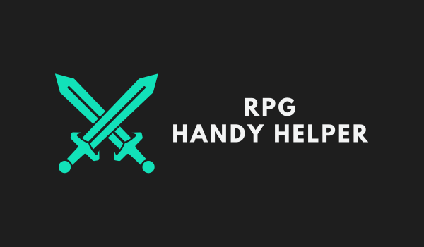

    

# RPG Handy Helper

Welcome to the RPG Handy Helper!

This is a project that helps game masters to manage their RPG sessions. It will contain a lot of features that will help you to manage your sessions, like a dice roller, a character sheet, a battle map, and more.

## State of the project

This project is in the early stages of development. We are working on the first version of the project, which will contain the dice roller and the character sheet. We are also working on the project's architecture and the project's documentation.

Actual progress (which is eqivalent to the `main` branch) can be found [here](https://rpg.adrian-goral.dev).

**Disclaimer!** This link may not work and the server may be down. We are hosting the project on our own server, so it may not be available all the time. Also you may (and probably will) encounter some bugs, as the project is still in development. If you encounter any bugs, please report them in the issues tab.
